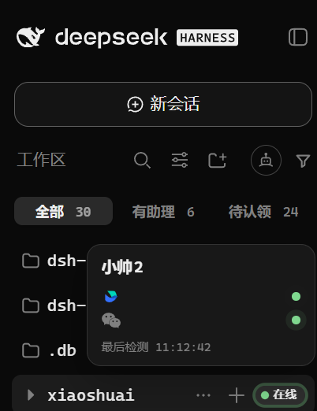

<h1 align="center">dsh-im-companion
</h1>

<div align="center">

**中文** · [English](docs/README.en.md)

**机器人接进来了，接下来呢？**  
[dsh-im](https://github.com/FeatherHunter/dsh-im) 把各渠道机器人接进 DSH，IM 辅助把它们变成听你调度的助理舰队：谁在线一眼看清，换家拖一下就行。

你的 ⭐是我夜空中最亮的星。

*Give every agent a home — IM Companion handles the rest.*

[](https://www.npmjs.com/package/dsh-im-companion) [](https://www.npmjs.com/package/dsh-im-companion) [](https://github.com/FeatherHunter/dsh-im-companion/commits/master) [](LICENSE) [](https://github.com/FeatherHunter/dsh-im) [](https://github.com/FeatherHunter/dsh-im-companion/issues)

<strong>👇 有助理的工作区，一目了然。</strong>


**装它，1 分钟（先装 dsh-im，再装辅助）。**

</div>

<h2 align="center"><sub>INSTALL</sub><br>安装</h2>

<div align="center">

前置要求：[DSH](https://www.npmjs.com/package/@deepseek-ai/dsh)（DeepSeek Harness）+ [dsh-im](https://github.com/FeatherHunter/dsh-im)（IM 机器人本体）。本体负责把机器人接进来，辅助负责把它们管起来。

</div>

```bash
# 1 安装 DSH CLI（已装跳过）
npm install -g @deepseek-ai/dsh

# 2 先装本体 dsh-im（已装跳过，同样 --profile 必填）
dsh plugin --profile desktop add dsh-im
#     或者
dsh plugin --profile web add dsh-im

# 3 再装辅助（--profile 必填，装进实际使用的入口）
dsh plugin --profile desktop add dsh-im-companion
#     或者
dsh plugin --profile web add dsh-im-companion

# 锁定版本更稳（当前 0.1.0）
dsh plugin --profile desktop add dsh-im-companion@0.1.0 --registry https://registry.npmjs.org
```

<div align="center">

装完按 **Ctrl+F5 刷新页面**即生效；如果没出现，完全退出 DSH 重开一次就行。

</div>

<details>
<summary>把安装交给你的 AI</summary>

复制下面这段发给你的 AI：

```text
请帮我安装 DeepSeek Harness 插件 dsh-im-companion（IM 辅助）。
先读仓库 README：https://github.com/FeatherHunter/dsh-im-companion
先确认我实际使用的 DSH 入口对应哪个 profile（桌面应用走 desktop，自启 web 服务走 web），
先确认 dsh-im 本体已装进同一个 profile（没装先装），再把辅助装进正确的 profile。
```

</details>

<details>
<summary>更新不生效时怎么装</summary>

下面以 desktop 为例，web 用户请把 --profile desktop 换成 --profile web：

```bash
dsh plugin --profile desktop add dsh-im-companion@0.1.0 --registry https://registry.npmjs.org
npx --yes @deepseek-ai/dsh plugin --profile desktop add dsh-im-companion
dsh plugin --profile desktop add dsh-im-companion@latest --registry https://registry.npmjs.org
```

</details>

升级 · 卸载：

```bash
dsh plugin --profile desktop update dsh-im-companion
dsh plugin --profile desktop remove dsh-im-companion
```

<h2 align="center"><sub>WHY</sub><br>为什么要做 IM 辅助</h2>

<div align="center">

dsh-im 接入很方便，扫码就行。可机器人一多，问题就来了：哪个已安家、哪个还空着、谁在线谁离线，旧的入口列表回答不了。

IM 辅助就是干这个的——把机器人按助理收好：

**左栏一眼看清**——在线亮绿灯，离线灰着，谁在谁不在，开屏即知。

**舰队拖一下就搬**——抽屉看家底，雷达看全局，串门拖一下换房。

本体管接入，辅助管安家。它不代替 dsh-im，配着用。

<strong>👇 点“有助理”，只看已安家的。</strong>


</div>

<h2 align="center"><sub>IN ACTION</sub><br>真机演示</h2>

<div align="center">

<strong>👇 进设置 → IM机器人辅助：助理、渠道、在线状态一屏看尽。</strong>


<strong>👇 点“添加接入”：选家后扫码即绑定。</strong>


<strong>👇 点开助理卡：模式、状态、各渠道增强开关一目了然。</strong>


<strong>👇 舰队雷达：Agent × 渠道矩阵，全舰队谁在线一眼看清。</strong>


<div align="center">
<table>
<tr>
<td align="center" width="50%">
<sub>👇 悬停看双通道 + 最后检测时间</sub>
<br>
</td>
<td align="center" width="50%">
<sub>👇 浅色主题同样可用</sub>
<br>
</td>
</tr>
</table>
</div>

<strong>👇 串门搬家：把照片拖到另一家，二次确认。绿灯在岗，黄灯打盹，灰灯睡着。</strong>


在线的 7 个功能模块：left-badges 左栏徽标 · left-filter 一键过滤 · session-header 工作区浮层 · detail-drawer 详情抽屉 · fleet-radar 舰队雷达 · adopt 串门搬家（拖拽换绑） · presence 在场呼吸灯。welcome-banner 拟人化迎宾暂不上线（已屏蔽，解开即恢复）。

上游本体与接入教程：[dsh-im](https://github.com/FeatherHunter/dsh-im)

</div>

<h2 align="center"><sub>FAQ</sub><br>常见问题</h2>

<details open>
<summary>更新之后还是旧版本？</summary>

这是桌面端 pnpm 供应链策略（minimumReleaseAge）导致的：刚发布的版本几小时内 update 会静默跳过。请 Ctrl+F5 刷新；还没更新就显式指定官方源装一次：

```bash
dsh plugin --profile desktop add dsh-im-companion@latest --registry https://registry.npmjs.org
```

</details>

<details>
<summary>不装 dsh-im，辅助能用吗？</summary>

不能。连接扫码凭据全在本体；辅助只做收纳总览。先装本体，再装辅助，且进同一个 profile。

</details>

<details>
<summary>刷新还是重启？</summary>

优先热更新：重打 lib 后刷新页面或热重载即可；无必要绝不重启。重启仅在 host 装配结构动了且热重载吃不下时才用。

</details>

<details>
<summary>浅色主题能用吗？</summary>

能。徽标、过滤、面板都跟随主题，上面有一张浅色实拍。

</details>

<h2 align="center"><sub>ARCHITECTURE</sub><br>架构</h2>

<div align="center">

在线的 7 个模块：左栏徽标 · 一键过滤 · 工作区浮层 · 详情抽屉 · 舰队雷达 · 串门搬家 · 在场呼吸灯。

代码组织方式写给开发者看：[docs/features-contract.md](docs/features-contract.md) · [CONTEXT.md](CONTEXT.md)

</div>

<h2 align="center"><sub>DEVELOPMENT</sub><br>开发</h2>

改代码只改 src/features 下自己功能的目录；lib 是构建产物，别手改。单文件不超 300 行。

```bash
npm run build        # host(tsc) + client(tsdown) 到 lib/
npm run typecheck
npm run verify       # 渲染 + 功能断言 + 连接二维码
npm run guard        # 300 行红线
npm run check        # 上面全跑（提审前必绿）
python -m http.server 8788  # 预览 preview.html
```

完整契约见 [docs/features-contract.md](docs/features-contract.md)。发布流程见 [scripts/wizard-release.sh](scripts/wizard-release.sh)（只扫码向导）。

<h2 align="center"><sub>MORE</sub><br>作者的其他作品</h2>

<div align="center">

**[dsh-im](https://github.com/FeatherHunter/dsh-im)** —— IM 机器人本体：9 渠道扫码接入，先装它

**[dsh-mattpocock-skills-deck](https://github.com/FeatherHunter/dsh-mattpocock-skills-deck)** —— Matt Pocock 技能面板：25 个工程与效率技能即装即用

**[dsh-better-sidebar](https://github.com/FeatherHunter/dsh-better-sidebar)** —— 窄屏更好用：并排看列表与详情

---

有问题？[提交 ISSUE](https://github.com/FeatherHunter/dsh-im-companion/issues)，认领前先读 docs/agents 标签纪律。

个人作品，与 dsh-im 同一作者。MIT © FeatherHunter

</div>

<h2 align="center"><sub>THANKS</sub><br>致谢</h2>

<div align="left">

感谢每一位提交 Issue、PR 与参与讨论的朋友。

首个公开版（v0.1.0）尚无外部贡献名单，虚位以待——第一个提 Issue 的朋友，你的名字会写在这里。

也感谢上游 [dsh-im](https://github.com/FeatherHunter/dsh-im)：没有本体，就没有辅助。

</div>

<h2 align="center"><sub>CONNECT</sub><br>加入我们</h2>

<div align="center">

Bug 与需求请直接提 ISSUE，更高效可追溯。

[提交 ISSUE](https://github.com/FeatherHunter/dsh-im-companion/issues) · [上游 dsh-im](https://github.com/FeatherHunter/dsh-im)

<sub>话题群二维码待补——有群后这里放永久有效二维码。</sub>

</div>