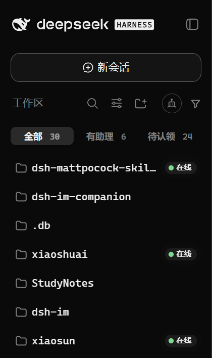
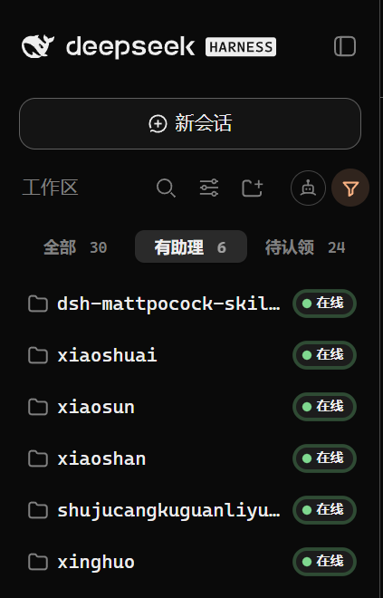
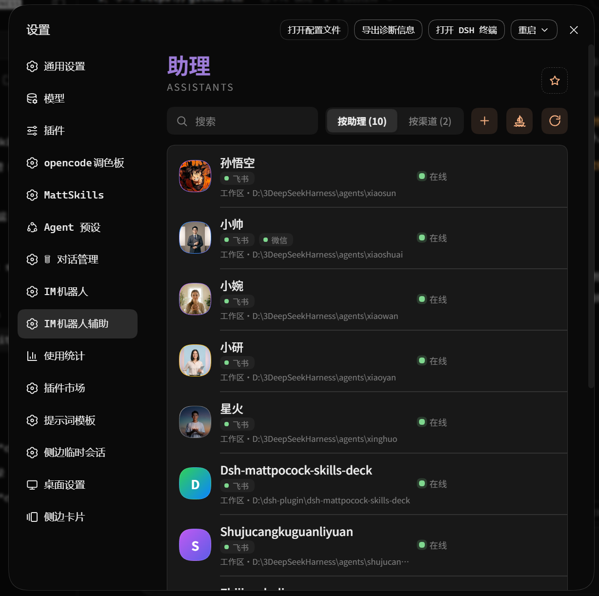
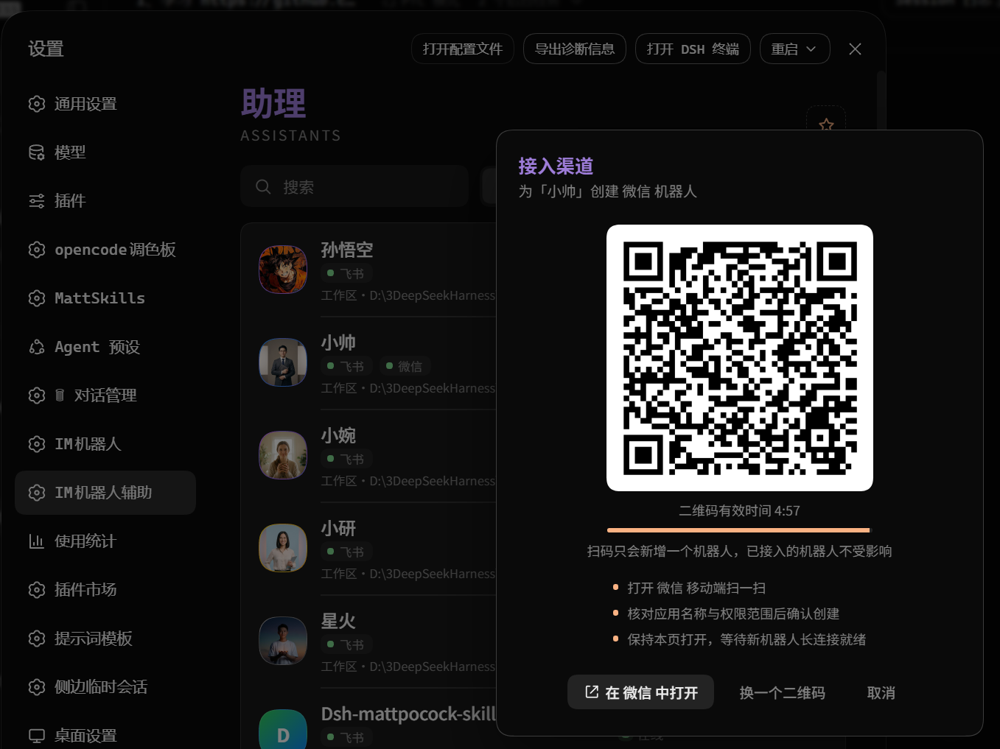
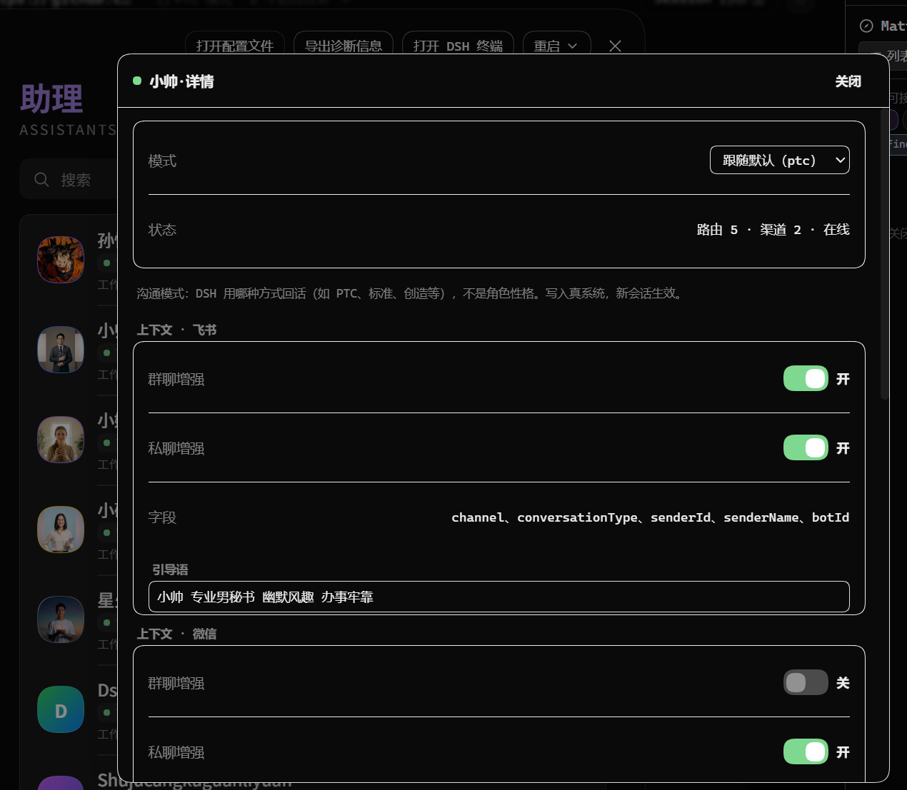
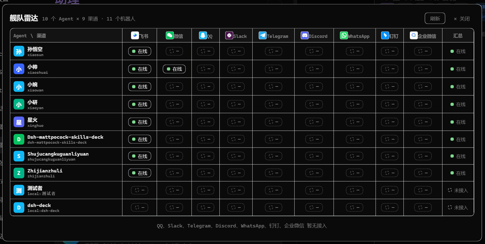
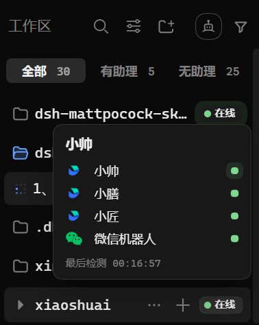
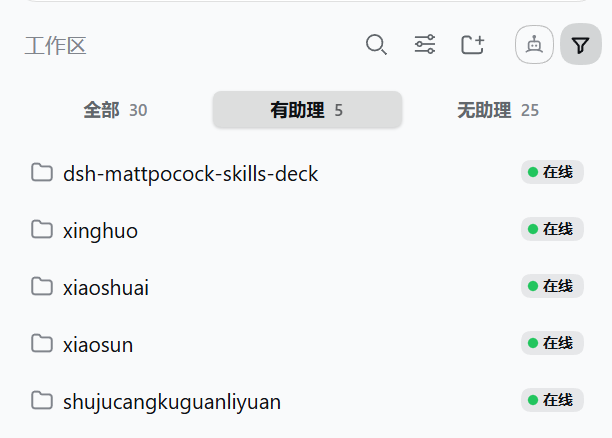
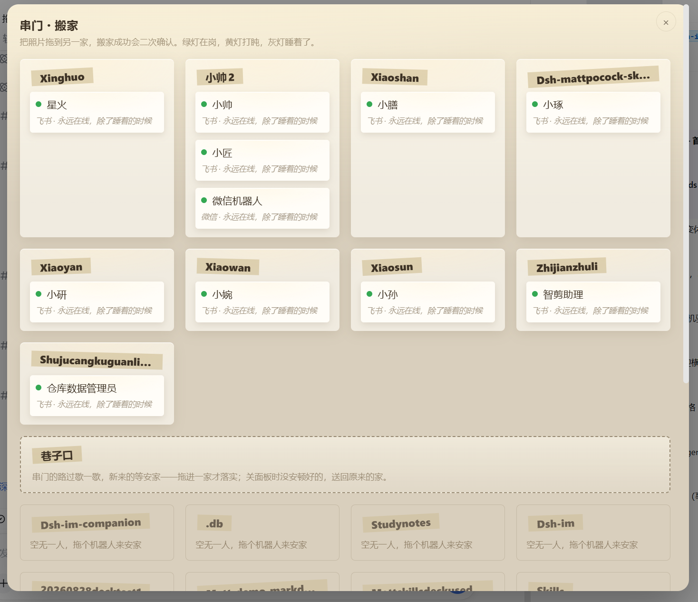

<h1 align="center">dsh-im-companion
</h1>

<div align="center">

**中文** · [English](docs/README.en.md)

**dsh-im-companion 以助理和家的概念增强dsh-im的使用体验。**

你的 ⭐是我夜空中最亮的星。

*Give every agent a home — IM Companion handles the rest.*

[](https://www.npmjs.com/package/dsh-im-companion) [](https://www.npmjs.com/package/dsh-im-companion) [](https://github.com/xmanrui/dsh-im-companion/commits/master) [](LICENSE) [](https://github.com/xmanrui/dsh-im) [](https://github.com/xmanrui/dsh-im-companion/issues)

<strong>👇 有助理的工作区，一目了然。</strong>



**装它，1 分钟（先装 dsh-im，再装辅助）。**

</div>

<h2 align="center"><sub>INSTALL</sub><br>安装</h2>

<div align="center">

前置要求：[DSH](https://www.npmjs.com/package/@deepseek-ai/dsh)（DeepSeek Harness）+ [dsh-im](https://github.com/xmanrui/dsh-im)（IM 机器人本体）。

</div>

```bash
# 1 安装 DSH CLI（已装跳过）
npm install -g @deepseek-ai/dsh

# 2 先装本体 dsh-im（已装跳过，同样 --profile 必填）
dsh plugin --profile desktop add dsh-im
#     或者
dsh plugin --profile web add dsh-im

# 3 再装辅助（--profile 必填，装进实际使用的入口）
dsh plugin --profile desktop add dsh-im-companion
#     或者
dsh plugin --profile web add dsh-im-companion

# 锁定版本更稳（当前 0.1.0）
dsh plugin --profile desktop add dsh-im-companion@0.1.0 --registry https://registry.npmjs.org
```

<div align="center">

装完刷新页面即生效。若面板没有出现，请完全退出 DSH 后重新打开。

</div>

<details>
<summary>把安装交给你的 AI</summary>

复制下面这段发给你的 AI：

```text
请帮我安装 DeepSeek Harness 插件 dsh-im-companion（IM 辅助）。
先读仓库 README：https://github.com/xmanrui/dsh-im-companion
先确认我实际使用的 DSH 入口对应哪个 profile（桌面应用走 desktop，自启 web 服务走 web），
先确认 dsh-im 本体已装进同一个 profile（没装先装），再把辅助装进正确的 profile。
```

</details>

<details>
<summary>更新不生效时怎么装</summary>

下面以 desktop 为例，web 用户请把 --profile desktop 换成 --profile web：

```bash
dsh plugin --profile desktop add dsh-im-companion@0.1.0 --registry https://registry.npmjs.org
npx --yes @deepseek-ai/dsh plugin --profile desktop add dsh-im-companion
dsh plugin --profile desktop add dsh-im-companion@latest --registry https://registry.npmjs.org
```

</details>

升级 · 卸载：

```bash
dsh plugin --profile desktop update dsh-im-companion
dsh plugin --profile desktop remove dsh-im-companion
```

<h2 align="center"><sub>WHY</sub><br>为什么要做 IM 辅助</h2>

<div align="center">

dsh-im 掌管接入，dsh-im-companion 以助理和家的概念增强能力。

**家**：哪个工作区有助理在管、在不在线，尽收眼底；搬家拖一下就行。

<strong>👇 点“有助理”，只看已安家的。</strong>



</div>

<h2 align="center"><sub>IN ACTION</sub><br>真机演示</h2>

<div align="center">

<strong>👇 进设置 → IM机器人辅助：助理、渠道、在线状态一屏看尽。</strong>



<strong>👇 点“添加接入”：选家后扫码即绑定。</strong>



<strong>👇 点开助理卡：模式、状态、各渠道增强开关一目了然。</strong>



<strong>👇 舰队雷达：Agent × 渠道矩阵，全舰队谁在线一眼看清。</strong>



<div align="center">
<table>
<tr>
<td align="center" valign="top" width="50%">
<strong>👇 悬停看双通道 + 最后检测时间</strong>
<br>
</td>
<td align="center" valign="top" width="50%">
<strong>👇 浅色主题同样可用</strong>
<br>
</td>
</tr>
</table>
</div>

<strong>👇 串门搬家：把照片拖到另一家，二次确认。绿灯在岗，黄灯打盹，灰灯睡着。</strong>



</div>

<h2 align="center"><sub>FAQ</sub><br>常见问题</h2>

<details open>
<summary>更新之后还是旧版本？</summary>

这是桌面端的应用市场缓存策略导致的：刚发布的版本几小时内更新会静默跳过。等几小时再更新；等不及就显式指定官方源装一次：

```bash
dsh plugin --profile desktop add dsh-im-companion@latest --registry https://registry.npmjs.org
```

</details>

<h2 align="center"><sub>MORE</sub><br>作者的其他作品</h2>

<div align="center">

**[dsh-opencode-palette](https://github.com/FeatherHunter/dsh-opencode-palette)** —— 34 款 opencode 经典配色，一键换装

**[dsh-mattpocock-skills-deck](https://github.com/FeatherHunter/dsh-mattpocock-skills-deck)** —— Matt Pocock 技能面板：25 个工程与效率技能即装即用

**[dsh-chinese-skill-patch](https://github.com/FeatherHunter/dsh-chinese-skill-patch)** —— 中文技能名直达，不必改英文名

**[dsh-prompt](https://github.com/FeatherHunter/dsh-prompt)** —— Prompt 工具箱：24 条深度模板随手点

---

有问题？[提交 ISSUE](https://github.com/xmanrui/dsh-im-companion/issues)，认领前先读 docs/agents 标签纪律。

MIT © FeatherHunter

</div>

<h2 align="center"><sub>THANKS</sub><br>致谢</h2>

<div align="left">

感谢每一位提交 Issue、PR 与参与讨论的朋友。

首个公开版（v0.1.0）尚无外部贡献名单，虚位以待——第一个提 Issue 的朋友，你的名字会写在这里。

也感谢上游 [dsh-im](https://github.com/xmanrui/dsh-im)：没有本体，就没有辅助。

</div>

<h2 align="center"><sub>CONNECT</sub><br>加入我们</h2>

<div align="center">

Bug 与需求请直接提 ISSUE，更高效可追溯。

[提交 ISSUE](https://github.com/xmanrui/dsh-im-companion/issues) · [上游 dsh-im](https://github.com/xmanrui/dsh-im)

<sub>话题群二维码待补——有群后这里放永久有效二维码。</sub>

</div>