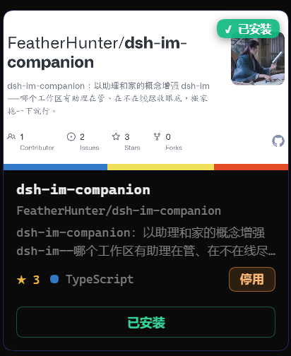
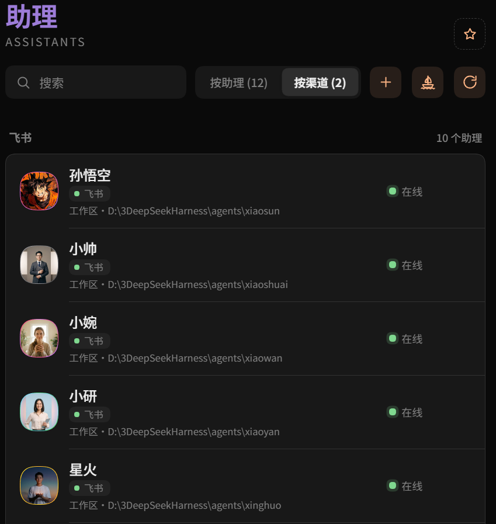
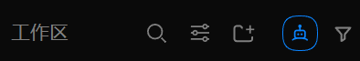
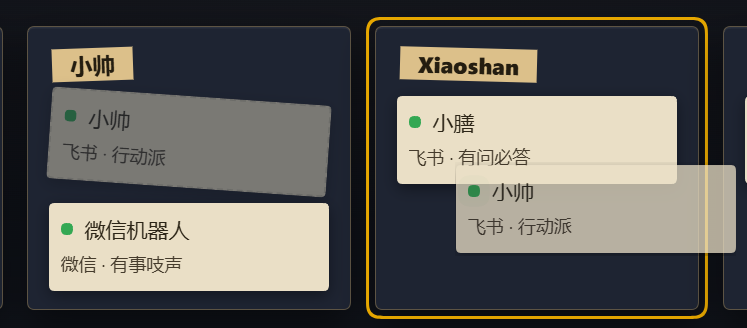
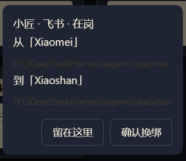

<h1 align="center">dsh-im-companion
</h1>

<div align="center">

**Chinese** · [中文](../README.md)

**dsh-im-companion enhances dsh-im with the concepts of assistants and homes.**

Your star means the world to me.

*Give every agent a home — IM Companion handles the rest.*

[](https://www.npmjs.com/package/dsh-im-companion) [](https://www.npmjs.com/package/dsh-im-companion) [](https://github.com/FeatherHunter/dsh-im-companion/commits/master) [](../LICENSE) [](https://github.com/xmanrui/dsh-im) [](https://github.com/FeatherHunter/dsh-im-companion/issues)

<strong>👇 Workspaces with assistants, at a glance.</strong>


**One minute to install (dsh-im first, then the companion).**

</div>

<h2 align="center"><sub>INSTALL</sub><br>Installation</h2>

<div align="center">

Prerequisites: [DSH](https://www.npmjs.com/package/@deepseek-ai/dsh) (DeepSeek Harness) + [dsh-im](https://github.com/xmanrui/dsh-im) (the IM bot core).

</div>

```bash
# 1. Install the DSH CLI (skip if installed)
npm install -g @deepseek-ai/dsh

# 2. Install the dsh-im core first (skip if installed; --profile is required too)
dsh plugin --profile desktop add dsh-im
#     or
dsh plugin --profile web add dsh-im

# 3. Then install the companion (--profile is required: the entry you actually use)
dsh plugin --profile desktop add dsh-im-companion
#     or
dsh plugin --profile web add dsh-im-companion

# Pin a version for stability (current: 0.1.0)
dsh plugin --profile desktop add dsh-im-companion@0.1.0 --registry https://registry.npmjs.org
```

<div align="center">

Refresh the page after installing and it takes effect. If the panel does not show up, quit DSH completely and reopen it.

</div>

<details>
<summary>Let your AI do the installing</summary>

Copy the text below and send it to your AI:

```text
Please install the DeepSeek Harness plugin dsh-im-companion (the IM companion).
Read the repo README first: https://github.com/FeatherHunter/dsh-im-companion
First confirm which profile my DSH entry uses (desktop app goes to desktop, self-hosted web service goes to web),
then confirm the dsh-im core is in the same profile (install it first if missing), then install the companion into the right profile.
```

</details>

<details>
<summary>When updates do not apply</summary>

Below uses desktop as the example; web users replace --profile desktop with --profile web:

```bash
dsh plugin --profile desktop add dsh-im-companion@0.1.0 --registry https://registry.npmjs.org
npx --yes @deepseek-ai/dsh plugin --profile desktop add dsh-im-companion
dsh plugin --profile desktop add dsh-im-companion@latest --registry https://registry.npmjs.org
```

</details>

Upgrade · Uninstall:

```bash
dsh plugin --profile desktop update dsh-im-companion
dsh plugin --profile desktop remove dsh-im-companion
```

<div align="center">

<strong>👇 Follow the steps and it installs: the market shows it installed.</strong>



</div>

<h2 align="center"><sub>WHY</sub><br>Why an IM companion</h2>

<div align="center">

dsh-im owns connecting; dsh-im-companion adds capabilities through the concepts of assistants and homes.

**Home**: which workspace has an assistant minding it, online or not, all in view; moving takes one drag.

<strong>👇 Click “with-assistant” to see only settled homes.</strong>


</div>

<h2 align="center"><sub>IN ACTION</sub><br>Live demos</h2>

<div align="center">

<strong>👇 Settings → IM companion: assistants, channels and online states on one screen.</strong>


<strong>👇 Switch to channels: same-channel assistants line up.</strong>



<strong>👇 Click “add connection”: pick a home, scan, bound.</strong>


<strong>👇 Open an assistant card: mode, status and per-channel switches at a glance.</strong>


<strong>👇 Fleet radar: the Agent × channel matrix shows the whole fleet online state.</strong>


<div align="center">
<table>
<tr>
<td align="center" valign="top" width="50%">
<strong>👇 Hover for channels + last check time</strong>
<br>
</td>
<td align="center" valign="top" width="50%">
<strong>👇 Light theme works too</strong>
<br>
</td>
</tr>
</table>
</div>

<strong>👇 Click the robot-face icon in the toolbar to open the moving panel</strong>



<strong>👇 Move house: drag the photo to another home, confirm twice. Green on duty, yellow napping, grey asleep.</strong>


<strong>👇 Drag the card over another home and the target lights up</strong>



<strong>👇 Confirm before moving</strong>



</div>

<h2 align="center"><sub>FAQ</sub><br>FAQ</h2>

<details open>
<summary>Still the old version after updating?</summary>

That is the desktop app-market cache: freshly published versions are silently skipped for a few hours. Wait a few hours and update again; if you cannot wait, install once with the explicit official registry:

```bash
dsh plugin --profile desktop add dsh-im-companion@latest --registry https://registry.npmjs.org
```

</details>

<h2 align="center"><sub>MORE</sub><br>More by the author</h2>

<div align="center">

**[dsh-opencode-palette](https://github.com/FeatherHunter/dsh-opencode-palette)** —— 34 classic opencode themes, one-click switch

**[dsh-mattpocock-skills-deck](https://github.com/FeatherHunter/dsh-mattpocock-skills-deck)** —— Matt Pocock skills deck: 25 engineering and productivity skills, ready to use

**[dsh-chinese-skill-patch](https://github.com/FeatherHunter/dsh-chinese-skill-patch)** —— Chinese skill names that just work, no English rename needed

**[dsh-prompt](https://github.com/FeatherHunter/dsh-prompt)** —— Prompt toolbox: 24 deep templates at hand

---

Questions? [File an ISSUE](https://github.com/FeatherHunter/dsh-im-companion/issues); read the docs/agents label rules before claiming.

MIT © FeatherHunter

</div>

<h2 align="center"><sub>THANKS</sub><br>Thanks</h2>

<div align="left">

Thanks to everyone who files Issues and PRs and joins discussions.

The first public release (v0.1.0) has no external contributors yet — the first person to file an Issue gets their name here.

Also thanks to upstream [dsh-im](https://github.com/xmanrui/dsh-im): no core, no companion.

</div>

<h2 align="center"><sub>CONNECT</sub><br>Join us</h2>

<div align="center">

Bugs and ideas go straight to ISSUEs — faster and traceable.

[File an ISSUE](https://github.com/FeatherHunter/dsh-im-companion/issues) · [Upstream dsh-im](https://github.com/xmanrui/dsh-im)

<sub>Topic-group QR coming — a permanent one will live here once there is a group.</sub>

</div>