<h1 align="center">dsh-im-companion
</h1>

<div align="center">

**Chinese** · [中文](../README.md)

**dsh-im-companion enhances dsh-im with the concepts of assistants and homes.**

Your star means the world to me.

*Give every agent a home — IM Companion handles the rest.*

[](https://www.npmjs.com/package/dsh-im-companion) [](https://www.npmjs.com/package/dsh-im-companion) [](https://github.com/FeatherHunter/dsh-im-companion/commits/master) [](../LICENSE) [](https://github.com/xmanrui/dsh-im) [](https://github.com/FeatherHunter/dsh-im-companion/issues)

<table>
<tr>
<td align="center" valign="top" width="50%">
<strong>👇 Workspaces with assistants, at a glance.</strong>
<br>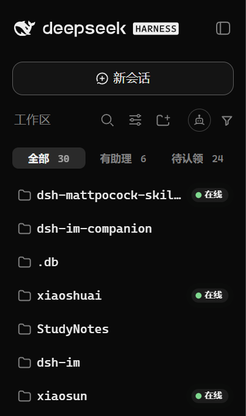
</td>
<td align="center" valign="top" width="50%">
<strong>👇 Enhances DSH's native session states.</strong>
<br>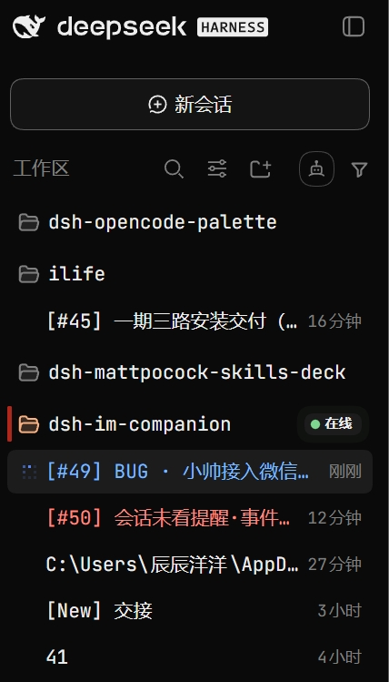
</td>
</tr>
</table>

**One minute to install (dsh-im first, then the companion).**

</div>

<h2 align="center"><sub>INSTALL</sub><br>Installation</h2>

<div align="center">

Prerequisites: [DSH](https://www.npmjs.com/package/@deepseek-ai/dsh) (DeepSeek Harness) + [dsh-im](https://github.com/xmanrui/dsh-im) (the IM bot core).

</div>

```bash
# 1. Install the DSH CLI (skip if installed)
npm install -g @deepseek-ai/dsh

# 2. Install the dsh-im core first (skip if installed; --profile is required too)
dsh plugin --profile desktop add dsh-im
#     or
dsh plugin --profile web add dsh-im

# 3. Then install the companion (--profile is required: the entry you actually use)
dsh plugin --profile desktop add dsh-im-companion
#     or
dsh plugin --profile web add dsh-im-companion

# Pin a version for stability (current: 0.2.3)
dsh plugin --profile desktop add dsh-im-companion@0.2.3 --registry https://registry.npmjs.org
```

<div align="center">

Refresh the page after installing and it takes effect. If the panel does not show up, quit DSH completely and reopen it.

</div>

<details>
<summary>Let your AI do the installing</summary>

Copy the text below and send it to your AI:

```text
Please install the DeepSeek Harness plugin dsh-im-companion (the IM companion).
Read the repo README first: https://github.com/FeatherHunter/dsh-im-companion
First confirm which profile my DSH entry uses (desktop app goes to desktop, self-hosted web service goes to web),
then confirm the dsh-im core is in the same profile (install it first if missing), then install the companion into the right profile.
```

</details>

<details>
<summary>When updates do not apply</summary>

Below uses desktop as the example; web users replace --profile desktop with --profile web:

```bash
dsh plugin --profile desktop add dsh-im-companion@0.2.3 --registry https://registry.npmjs.org
npx --yes @deepseek-ai/dsh plugin --profile desktop add dsh-im-companion
dsh plugin --profile desktop add dsh-im-companion@latest --registry https://registry.npmjs.org
```

</details>

Upgrade · Uninstall:

```bash
dsh plugin --profile desktop update dsh-im-companion
dsh plugin --profile desktop remove dsh-im-companion
```


<a name="compat"></a>
<h2 align="center"><sub>COMPAT</sub><br>Compatibility</h2>

<div align="center">

| dsh-im-companion | dsh-im | Notes |
| --- | --- | --- |
| **0.2.x** | **4.21.1** (verified) | Same transport rules as 0.1.16+; adds the update centre (panel-owned status polling, bounded by contract §4) plus two preference endpoints, `meta.motion.set` and `meta.update.set` |
| **0.1.16+** | **4.21.1** (verified) | Dual transport unchanged: 4.17.1+ uses the `/api` carrier, ≤4.17.0 falls back to the legacy route; 4.21.1's carrier rule re-checked as identical to 4.17.1 (`dsh-im<channel>` + `{ method, payload }`) |
| 0.1.7 – 0.1.15 | 4.17.1 (verified) | Dual transport: 4.17.1+ uses the `/api` carrier, ≤4.17.0 falls back to the legacy route automatically |
| 0.1.6 | 4.17.1 | **Fails to assemble in a web profile** (the host half used the retired prefix route: `cannot get property "webServer" without inject`) → upgrade to 0.1.7 |
| 0.1.4 | ≤4.17.0 | Broken after the dsh-im 4.17.1 carrier change (HTTP 405 in the connect wizard); upgrade to 0.1.7 |

Host `@deepseek-ai/dsh` **0.2.0-rc.2** verified (**0.2.2 pairs with exactly this host version**; the host must provide `connection.fetch`; older hosts fail loudly at assembly rather than degrading silently). The panel header shows two version capsules side by side, where the colour carries the identity: purple = this plugin's own version, blue-white = the compatible `dsh-im` version (`dsh-im 4.21.1`); the host dsh capsule has been removed, and host compatibility lives only in this section and the market badge (`engines.dsh`). Each capsule keeps only the axis name + version number, and the full wording lives on hover (values come from `package.json`, injected at build time).

</div>

<h2 align="center"><sub>WHY</sub><br>Why an IM companion</h2>

<div align="center">

dsh-im owns connecting; dsh-im-companion adds capabilities through the concepts of assistants and homes.

**Home**: which workspace has an assistant minding it, online or not, all in view; moving takes one drag.

<strong>👇 Click “with-assistant” to see only settled homes.</strong>

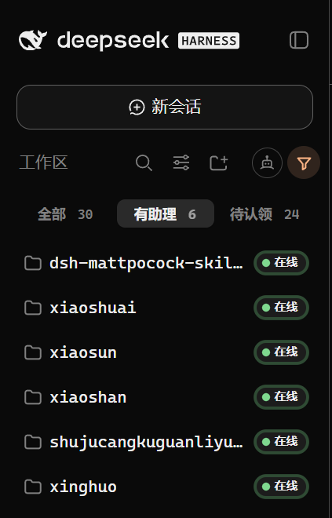

</div>

<h2 align="center"><sub>IN ACTION</sub><br>Live demos</h2>

<div align="center">

<strong>👇 Settings → IM companion: assistants, channels and online states on one screen.</strong>

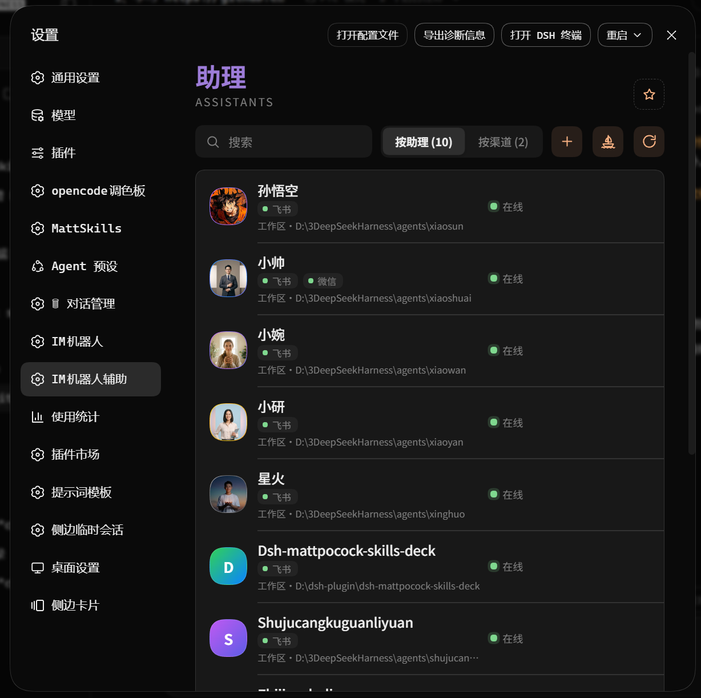

<strong>👇 Switch to channels: same-channel assistants line up.</strong>

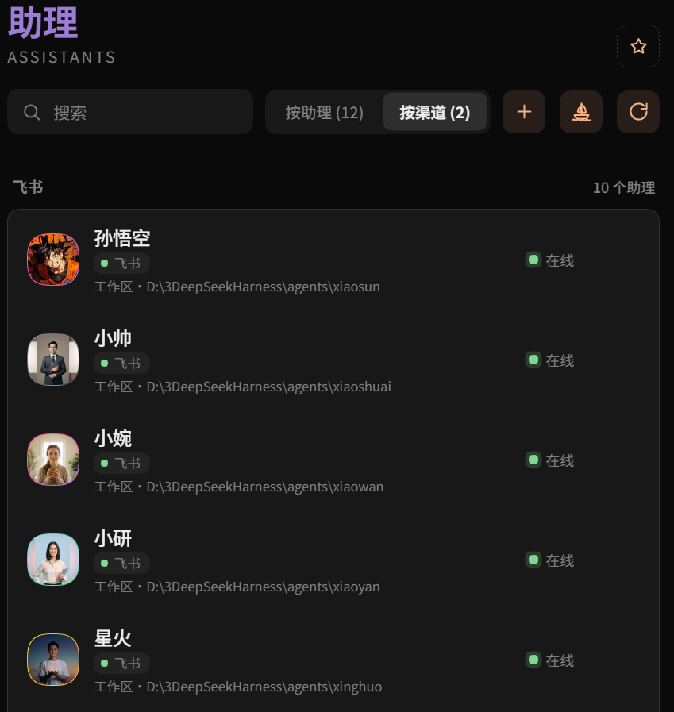

<strong>👇 Click “add connection”: pick a home, scan, bound.</strong>

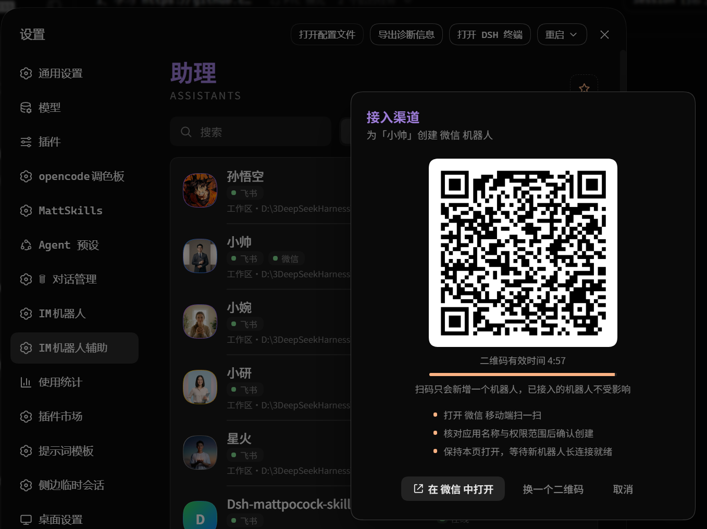

<strong>👇 Open an assistant card: mode, status and per-channel switches at a glance.</strong>

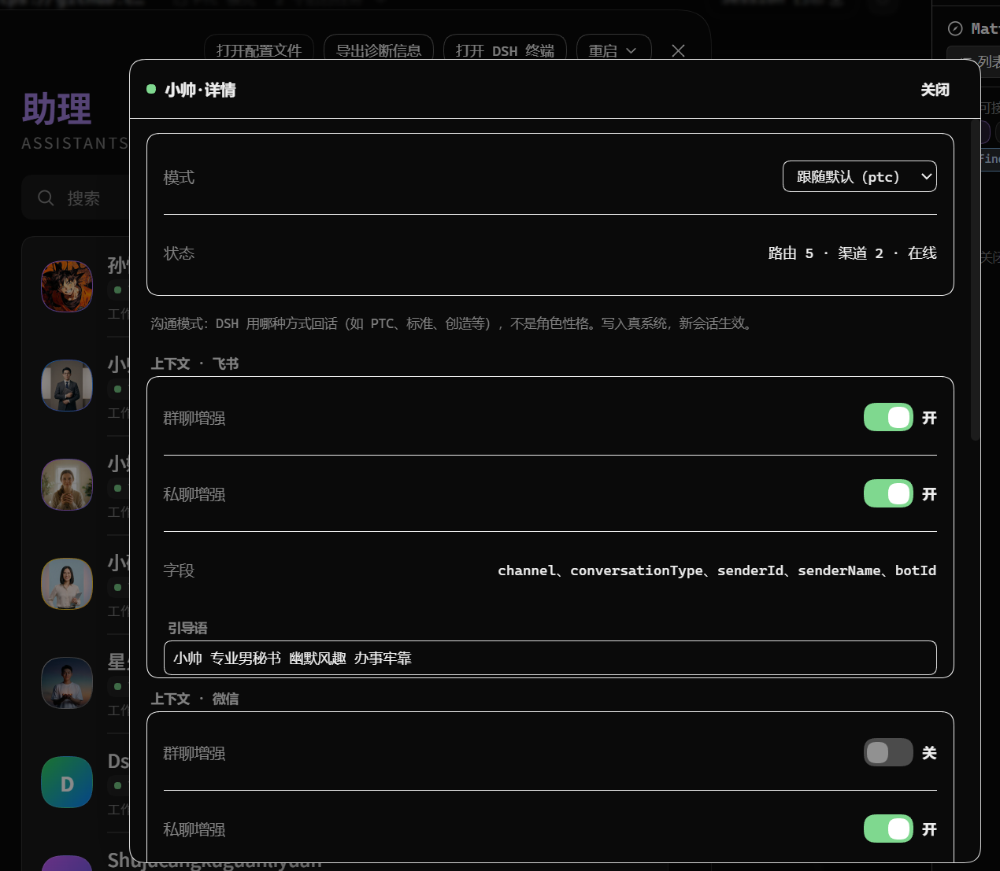

<strong>👇 Fleet radar: the Agent × channel matrix shows the whole fleet online state.</strong>

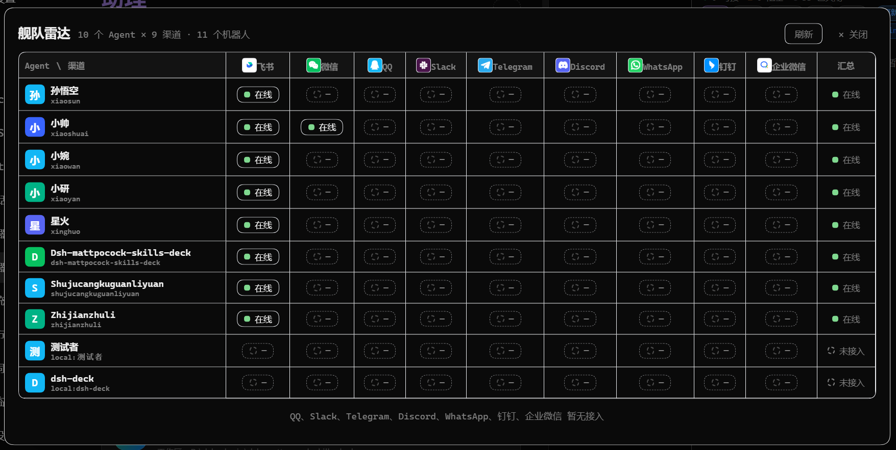

<strong>👇 Session states at a glance (DSH enhanced).</strong>

<div align="center">
<table>
<tr>
<td align="center" valign="top" width="50%">
<strong>👇 A blue bar means a session is running.</strong>
<br>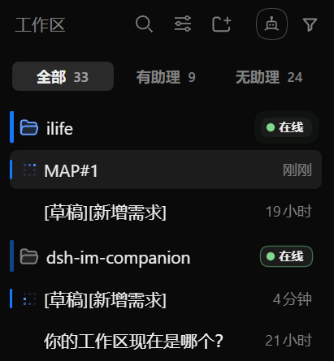
</td>
<td align="center" valign="top" width="50%">
<strong>👇 An orange bar means a message is waiting for you. It goes away once opened.</strong>
<br>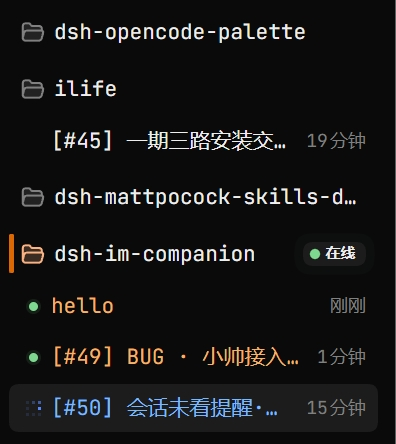
</td>
</tr>
</table>
</div>

<div align="center">
<table>
<tr>
<td align="center" valign="top" width="50%">
<strong>👇 Hover for channels + last check time</strong>
<br>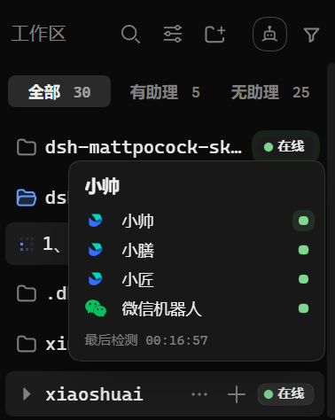
</td>
<td align="center" valign="top" width="50%">
<strong>👇 Light theme works too</strong>
<br>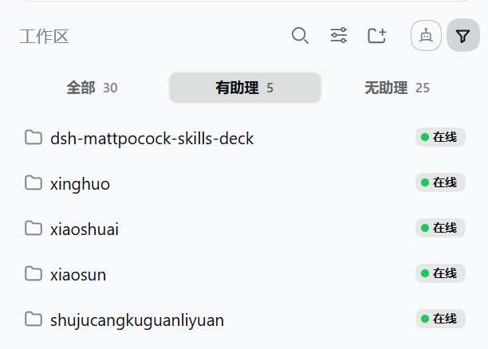
</td>
</tr>
</table>
</div>

<strong>👇 Click the robot-face icon in the toolbar to open the moving panel</strong>

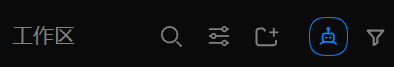

<strong>👇 Move house: drag the photo to another home, confirm twice. Green on duty, yellow napping, grey asleep.</strong>

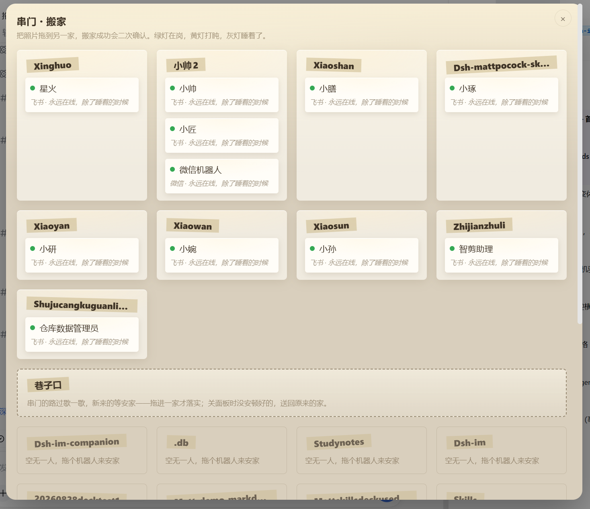

<strong>👇 Drag the card over another home and the target lights up</strong>

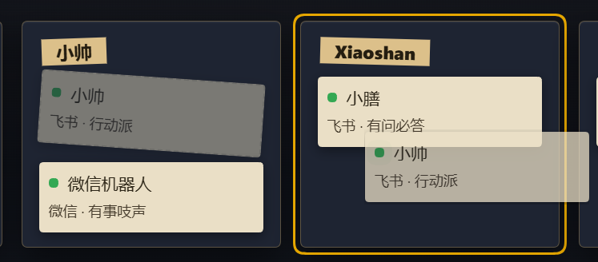

<strong>👇 Confirm before moving</strong>

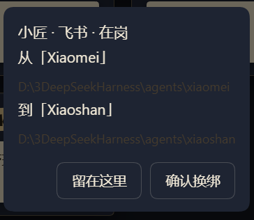

</div>

<h2 align="center"><sub>CAPABILITIES</sub><br>The capability map: four levels of granularity</h2>

The same capabilities, layered by how deep you want to reach in: **works on install** → **click in the panel** → **call programmatically** → **build your own feature**. AI readers can jump straight to L2 / L3 for the interface list.

| Level | What you want to do | Entry point | Code required? |
| --- | --- | --- | --- |
| **L0 zero-config** | See online states, filter, move house, install updates | Works right after install + refresh | No |
| **L1 panel controls** | Configure presets / channel enhancement / bindings / auto-check | Settings → IM Companion | No |
| **L2 programmatic** | Let an AI or another plugin read/write state, trigger check & install | Host bridge `POST /api/im-companion` + the four client contract channels | Call only; no repo changes |
| **L3 extension** | Add a new feature or endpoint | `FeatureManifest` + an `rpc` case | Yes |

<h3 align="center">L0 · Zero-config (there once installed)</h3>

| Capability | Where | Notes |
| --- | --- | --- |
| Rail online badge | Every workspace row | Green = on duty, yellow = napping, grey = asleep; hover shows both transports and the last check time; unbound rows draw nothing |
| Rail filter | Strip above the list + header funnel | All / with assistant / without assistant (with counts); the funnel cycles the three states, plus collapse-all |
| Group row status bars | Workspace group rows and session rows | Blue = a session is running (breathing), red = error (402 / aborted / unknown), yellow = waiting on you |
| Workspace header popup | Status dot in the session header | Assistant / channels / online state; send a test message (channel · bot · session pickers) |
| Fleet radar | Panel toolbar "Set sail!" | Agent × channel matrix; click a cell to drill into details |
| Update centre | Top block of the settings panel | Check / one-click install / restart-pending banner / release notes; reports "host bridge unavailable" explicitly when missing |
| Presence animation | Green dot left of the filter strip | Click to toggle the breathing animation (on by default); the preference is persisted to the host `meta.json` and respects the OS "reduce motion" setting |

<h3 align="center">L1 · Panel controls (Settings → IM Companion)</h3>

| What you tune | Where | Granularity |
| --- | --- | --- |
| Views & search | Segmented control at the top + search box | Aggregated view (by assistant) / by-channel view |
| Add a connection | Toolbar "New assistant" → pick a home | Two ways: **create by scanning** (one step) or **enter manually** (Slack manifest / Discord intent / Telegram proxy / WeCom Bot ID hints; secrets echo masked and never re-display) |
| Assistant details | Click an assistant card (or a rail badge) | Conversation preset (written to the real system, effective for new sessions), context enhancement (**two per-channel switches**: group / direct), personality, workspace path (native directory picker), session route summary, channel management (unbind needs confirmation), test send |
| Move house | Toolbar "Move house" | Drag onto another home → confirm "Rebind" → undo within 5 seconds |
| Update preferences | Update centre | Auto-check toggle + interval 6 / 12 / 24 (default) / 168 hours |
| Motion preference | Green dot in the filter strip | On / off |

Write protection: while a channel's truth has not been read, writes are disabled with "channel truth not read yet, try later (to avoid overwriting existing config)"; destructive actions always ask twice (`click again to confirm` / `Rebind` / `Unbind`).

<h3 align="center">L2 · Programmatic integration (for AIs and other plugins)</h3>

**Host bridge** (the plugin's only HTTP surface, registered on DSH's public `/api` carrier):

```text
POST /api/im-companion
request:  { "type":"client-request", "rpcId":"<your id>", "method":"im-companion",
            "payload": { "method":"<endpoint>", "payload": { … } } }
reply:    { "type":"server-response", "rpcId":"<same id>",
            "result": { "ok":true, "value": … } }
failure:  { "ok":false, "error": { "code":"bad-request", "message":"…", "details":{} } }
```

Endpoints:

| Endpoint | Payload | Returns |
| --- | --- | --- |
| `ping` | `{}` | `{ pong }` |
| `meta.get` | `{}` | full `AgentMetaDoc` snapshot |
| `meta.rename` | `{ key, name }` | `{}` |
| `meta.avatar.set` / `meta.avatar.clear` | `{ key, dataUrl }` / `{ key }` | `{}` |
| `meta.preset.set` | `{ key, preset }` | `{}` |
| `meta.ctx.set` | `{ key, enabled, level }` | `{}` |
| `meta.motion.set` | `{ manualReduced: boolean }` | `{}` |
| `meta.update.set` | `{ autoCheckEnabled: boolean, intervalHours }` (interval accepts 6 / 12 / 24 / 168 hours only) | `{}` |
| `meta.welcomed.set` | `{ workspace, seen }` | `{}` |
| `meta.local.add` / `meta.local.remove` | `{ name }` | `{}` |
| `meta.local.rename` | `{ from, to }` | `{}` |
| `meta.local.workspace` | `{ name, workspace }` | `{}` |
| `routes.list` | `{ bots: [{ channel, botId }] }` | `{ routes, skipped }` session route summary |
| `activity.snapshot` | `{}` | `{ entries, scannedAt }` session activity |
| `fs.defaultRoot` / `fs.roots` | `{}` | `{ path }` / `{ roots }` |
| `fs.list` | `{ path }` (absolute) | `{ path, parent, entries }` |
| `imc.updateStatus` / `imc.updateCheck` | `{}` | update snapshot (`snapshot` / `manual` / `autoCheck`) |
| `imc.updateInstall` | `{ checkId, requestId }` | install receipt |

Source of truth on disk: `~/.dsh/integrations/dsh-im-companion/meta.json` (overridable via `DSH_HOME` or the plugin's `config.dshHome`); `AgentMetaDoc` fields = `names` `avatars` `locals` `presets` `ctxEnhance` `welcomed` `motion` `update`.

**The four client contract channels** (when writing another plugin or feature):

| Channel | What you get | Rule |
| --- | --- | --- |
| `rpc` | `RpcCall`, going through dsh-im channel RPC | call `refresh()` after any write |
| `subscribe(fn)` | `StreamSnapshot = { bots, failed, updatedAt, catalogs }` | the only poller (15 s, one process-wide instance); **never open a second poll** |
| `meta` | `MetaStore` (`loadMeta()` + writers) | the host `meta.json` is authoritative; falls back to localStorage `af-fleet-*` when the bridge is unavailable |
| `slots` | Slots: `settings.section` (this plugin owns `id=dsh-im-companion`, `order=22`, label "IM Companion"), `workspace-rail`, `session-header`, `conversation-session` | register only; never reach into someone else's DOM |

Auxiliary surfaces: `window` event prefix `dsh-im-companion:*` (the cross-component bus — **not** one of the four whitelisted channels, and it does not replay); host service export `ctx.provide('agentFleet', { version, meta })`, so other plugins can read `meta.snapshot()`.

**Package exports** (after `npm i dsh-im-companion`): `.` → host entry `lib/index.js` (exports `name` / `inject` / `apply`); `./client` → the browser bundle (loaded through `__ModuleLoader__`, not a Node-importable module); `./package.json`.

<h3 align="center">L3 · Extension (add a feature / an endpoint)</h3>

1. A new feature = create `src/features/<id>/manifest.ts`, then add one line in `src/features/index.ts`.
2. `FeatureManifest = { id, name, order, slots[], installStyles? }`; the feature context `FeatureCtx = { rpc, subscribe, refresh, meta, slots, get, pickDirectory? }` — features reach capabilities only through it, never the host directly and never another feature.
3. A new endpoint = append one `case` in `src/host/rpc.ts` (named `im-companion.<feature>.<action>`); never change an existing case.
4. Red lines and self-checks: ≤300 lines per file; the shared layer is add-only; `npm run check` (build + types + functional assertions + line guard) must be green.
5. Contract authority: `docs/features-contract.md`; domain vocabulary: `CONTEXT.md`.

Hints for AIs: to change state use `meta.*`; to read state use `meta.get` + `activity.snapshot`; to install an update use `imc.updateCheck` → `imc.updateInstall`; to add a feature go to L3.

<h2 align="center"><sub>FAQ</sub><br>FAQ</h2>

<details open>
<summary>Still the old version after updating?</summary>

That is the desktop app-market cache: freshly published versions are silently skipped for a few hours. Wait a few hours and update again; if you cannot wait, install once with the explicit official registry:

```bash
dsh plugin --profile desktop add dsh-im-companion@latest --registry https://registry.npmjs.org
```

</details>

<h2 align="center"><sub>MORE</sub><br>More by the author</h2>

<div align="center">

**[dsh-opencode-palette](https://github.com/FeatherHunter/dsh-opencode-palette)** —— 34 classic opencode themes, one-click switch

**[dsh-mattpocock-skills-deck](https://github.com/FeatherHunter/dsh-mattpocock-skills-deck)** —— Matt Pocock skills deck: 25 engineering and productivity skills, ready to use

**[dsh-chinese-skill-patch](https://github.com/FeatherHunter/dsh-chinese-skill-patch)** —— Chinese skill names that just work, no English rename needed

**[dsh-prompt](https://github.com/FeatherHunter/dsh-prompt)** —— Prompt toolbox: 24 deep templates at hand

---

Questions? [File an ISSUE](https://github.com/FeatherHunter/dsh-im-companion/issues); read the docs/agents label rules before claiming.

MIT © FeatherHunter

</div>

<h2 align="center"><sub>THANKS</sub><br>Thanks</h2>

<div align="left">

Thanks to everyone who files Issues and PRs and joins discussions.

The first public release (v0.1.0) has no external contributors yet — the first person to file an Issue gets their name here.

Also thanks to upstream [dsh-im](https://github.com/xmanrui/dsh-im): no core, no companion.

</div>

<h2 align="center"><sub>CONNECT</sub><br>Join us</h2>

<div align="center">

Bugs and ideas go straight to ISSUEs — faster and traceable.

[File an ISSUE](https://github.com/FeatherHunter/dsh-im-companion/issues) · [Upstream dsh-im](https://github.com/xmanrui/dsh-im)

<sub>Topic-group QR coming — a permanent one will live here once there is a group.</sub>

</div>